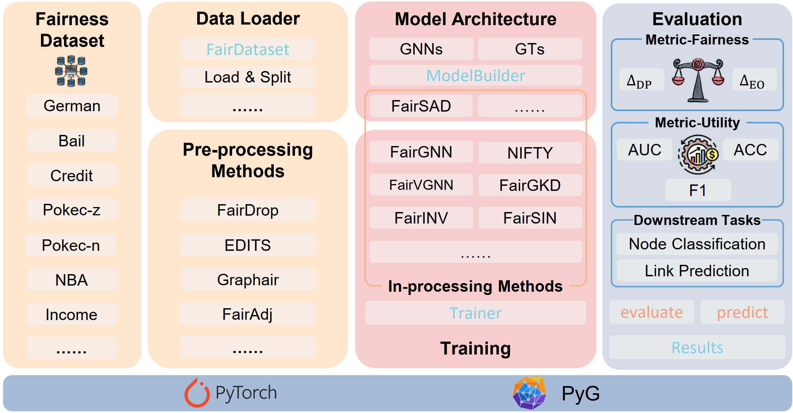

<div align="center">


# An Open-Source Toolkit for Fair Graph Deep Learning

</div>


<!-- 

 -->

## Overview
GroupFairness is an open-source toolkit for fair graph deep learning. It provides a collection of state-of-the-art algorithms for fair graph representation learning. The toolkit is designed to be easy to train and evaluate graph deep learning models. Specifically, GroupFairness includes five modules, i.e., datasets, data loader & pre-processing, model architecture, model training, model evaluation. The overview of the toolkit is shown in the figure below.
<div align="center">

</div>

## Quickstart

### Installation

### Usage
Get started with GNN training and evaluation in only five steps. Taking FairGNN as an example (refer to [Supported Algorithms](#supported-algorithms) for more fairness methods):
```python
from graphfairness.datasets.fair_datasets import FairDataset
from graphfairness.models import ModelBuilder
from graphfairness.methods.inprocess.fairgnn import FairGNN

# Step1: load data
device = torch.device('cuda' if args.cuda else 'cpu')
dataset = FairDataset(root='./', name='german')
fair_dataset = dataset.data
fair_dataset = fair_dataset.to(device)
nfeat = fair_dataset.features.shape[1]

# Step2: Initialize the GNN backbone
model_builder = ModelBuilder(device=device)
model = model_builder.build(model_name='gcn', nfeat=n_feat, nhid=[16], nclass=1, dropout=0.5)

# Step3: Create the fairness method instance
fairgnn = FairGNN(model, nfeat=n_feat, nhid=[16], nclass=2, dropout=0.5)

# Step4: Train the model
fairgnn.train(fair_dataset, epochs=1000, validation=True, alpha=4, beta=0.01)

# Step5: Evaluate the model
metrics = fairgnn.evaluate(fair_dataset)
print(f"Accuracy: {metrics['acc_val']:.4f}")
print(f"AUC: {metrics['auc_val']:.4f}")
print(f"Demographic Parity: {metrics['dp_val']:.4f}")
print(f"Equal Opportunity: {metrics['eo_val']:.4f}")
```

## Supported Algorithms
GroupFairness supports the following algorithms which can be categorized into pre-processing and in-processing methods.
- **Pre-processing Methods**: pre-processing methods aim to mitigate the bias in the graph data before training the model.
- **In-processing Methods**: in-processing methods aim to improve the fairness of the model during training.

| **Methods** | **Paper Title** | **Publication** | **Method Category** |
| --- | --- | --- | --- |
| CFC | [Compositional Fairness Constraints for Graph Embeddings](https://arxiv.org/pdf/1905.10674) | ICML 2019 | In-processing |
| Fairadj | [On Dyadic Fairness: Exploring and Mitigating Bias in Graph Connections](https://openreview.net/pdf?id=xgGS6PmzNq6) | ICLR 2021 | In-processing |
| FairDrop | [FairDrop: Biased Edge Dropout for Enhancing Fairness in Graph Representation Learning](https://arxiv.org/pdf/2104.14210) | IEEE Transactions on Artificial Intelligence 2021 | Pre-processing |
| EDITS | [EDITS: Modeling and Mitigating Data Bias for Graph Neural Networks](https://arxiv.org/pdf/2108.05233) | WWW 2022 | Pre-processing |
| Graphair | [Learning Fair Graph Representations via Automated Data Augmentations](https://openreview.net/pdf?id=1_OGWcP1s9w) | ICLR 2023 | Pre-processing |
| FairGNN | [Say No to the Discrimination: Learning Fair Graph Neural Networks with Limited Sensitive Attribute Information](https://arxiv.org/pdf/2009.01454) | WSDM 2021 | In-processing |
| NIFTY | [Towards a Unified Framework for Fair and Stable Graph Representation Learning](https://arxiv.org/pdf/2102.13186) | UAI 2021 | In-processing |
| FairVGNN | [Improving Fairness in Graph Neural Networks via Mitigating Sensitive Attribute Leakage](https://arxiv.org/pdf/2206.03426) | KDD 2022 | In-processing |
| FairSIN | [FairSIN: Achieving Fairness in Graph Neural Networks through Sensitive Information Neutralization](https://arxiv.org/pdf/2403.12474) | AAAI 2024 | In-processing |
| FairGKD | [The Devil is in the Data: Learning Fair Graph Neural Networks via Partial Knowledge Distillation](https://arxiv.org/pdf/2311.17373) | WSDM 2024 | In-processing |
| FairINV | [One Fits All: Learning Fair Graph Neural Networks for Various Sensitive Attributes](https://arxiv.org/pdf/2406.13544) | KDD 2024 | In-processing |
| FairSAD | [Fair Graph Representation Learning via Sensitive Attribute Disentanglement](https://arxiv.org/pdf/2405.07011) | WWW 2024 | In-processing |
| FairGB | [Rethinking Fair Graph Neural Networks from Re-balancing](https://arxiv.org/pdf/2407.11624) | KDD 2024 | In-processing |
| FairGT | [FairGT: A Fairness-aware Graph Transformer](https://arxiv.org/pdf/2404.17169) | IJCAI 2024 | In-processing |
| FUGNN | [FUGNN: Harmonizing Fairness and Utility in Graph Neural Networks](https://arxiv.org/pdf/2405.17034) | KDD 2024 | In-processing |
| FairGP | [FairGP: A Scalable and Fair Graph Transformer Using Graph Partitioning](https://arxiv.org/pdf/2412.10669) | AAAI 2025 | Pre-processing |
| FairDLA | [Fairdla: Improving the Fairness-Utility Trade-Off in Graph Neural Networks Via Dual-Level Alignment](https://www.sciencedirect.com/science/article/abs/pii/S0950705125008147) | KBS 2025 | In-processing |


## Get in Touch
We welcome contributions! If you have any questions or would like to integrate your fairness algorithm into our framework, please contact us:
- **Email**: [yuchang199704@gmail.com](mailto:yuchang199704@gmail.com)
